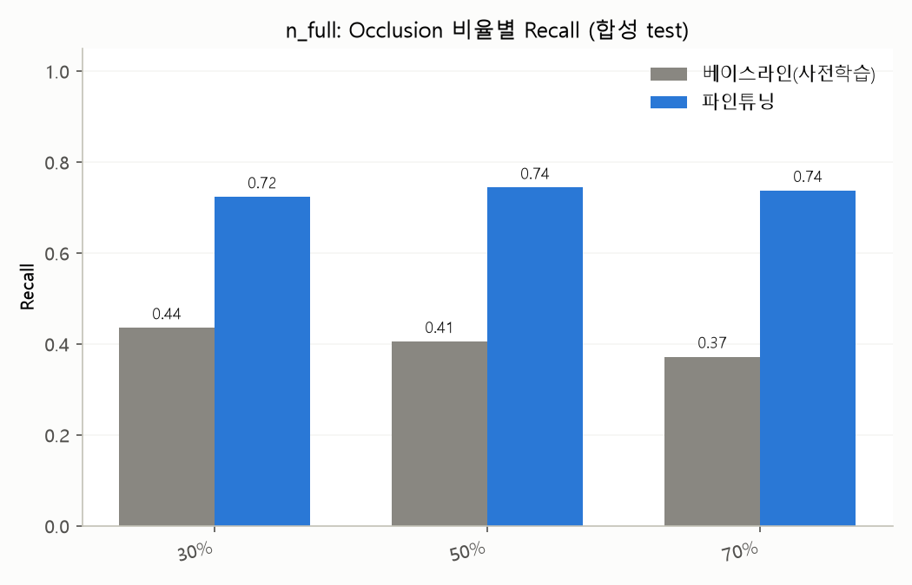
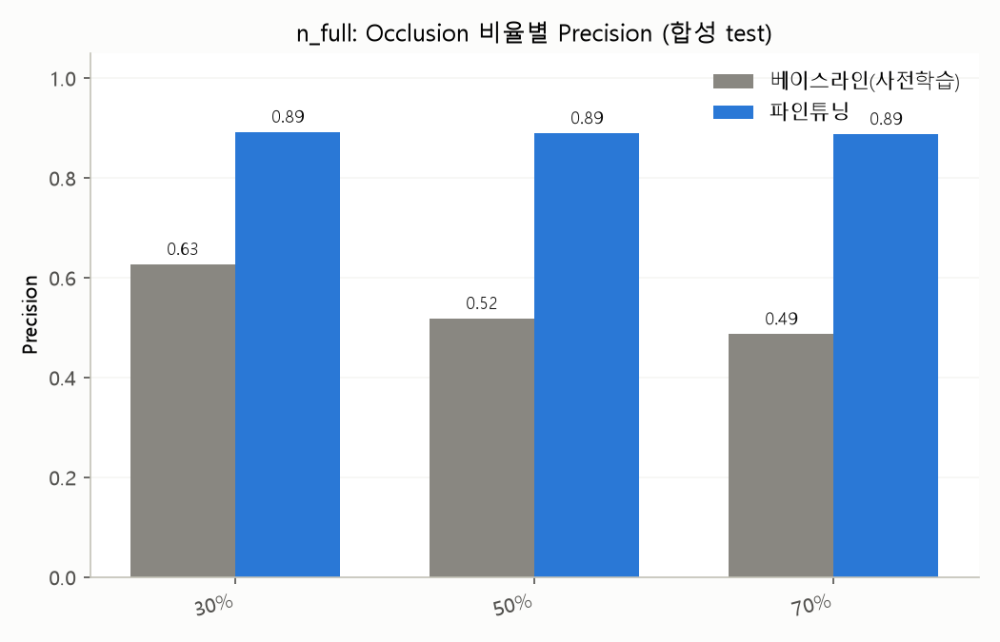
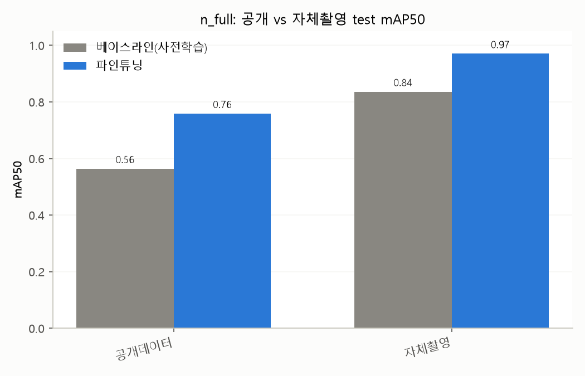

# MODEL_REPORT.md — YOLO11n(n_full) 본 학습 결과 보고서

Phase 3 산출물. DATASET.md 최종 분할(train 152,360 / val 19,088 / test 19,164, 소스별 비율
포함, PRD 7.4절)로 YOLO11n을 파인튜닝한 결과를 정리한다. 라벨링 방식은 PRD 6장/8장에서
확정된 **전체범위(full-extent) bbox**를 그대로 사용했다.

---

## 1. 실험 설정

| 항목 | 값 |
|---|---|
| 베이스 모델 | YOLO11n (COCO 사전학습, 2,582,347 파라미터) |
| 데이터 | `model/data/dataset.yaml` — train 152,360 / val 19,088 / test 19,164 |
| 이미지 해상도 | 640×640 |
| 배치 크기 | AutoBatch(RTX 3090 24GB 기준 자동 산정) → 25 |
| Epoch | 100 (patience=30 조기종료 조건, **실제로는 발동 안 함** — 마지막 epoch가 매번 최고 기록을 갱신) |
| 하드웨어 | Windows, RTX 3090 24GB, torch 2.13.0+cu130 |
| 총 학습 시간 | 약 24.4시간 (순수 GPU 학습 시간 합산 기준) |

### 1.1 중단 및 재개 이력

학습 도중 (epoch 38, 77% 지점) 그룹 정책으로 관리되는 연구실 PC가 예기치 않게 재부팅되어
약 7시간 공백이 발생했다. `last.pt` 체크포인트(epoch 37)에서 `resume=True`로 정확히
재개했으며, 재개 이후 데이터 손실은 없다 (진행 중이던 epoch 38의 일부만 재계산).

---

## 2. 학습 곡선 (Validation 기준)

| epoch | Precision | Recall | mAP50 | mAP50-95 |
|---|---|---|---|---|
| 1 | 0.789 | 0.601 | 0.709 | 0.451 |
| 20 | 0.837 | 0.662 | 0.775 | 0.519 |
| 40 | 0.841 | 0.677 | 0.787 | 0.531 |
| 60 | 0.844 | 0.680 | 0.791 | 0.536 |
| 80 | 0.847 | 0.686 | 0.798 | 0.544 |
| **100(최종)** | **0.852** | **0.694** | **0.805** | **0.552** |

100 epoch 내내 조기종료 없이 완만하지만 꾸준한 개선이 이어졌다 (patience=30 카운트가
한 번도 소진되지 않음 — 매 체크포인트가 직전 최고 기록을 갱신).

---

## 3. Test Set 성능 — 베이스라인 대비 개선 (핵심 결과)

베이스라인은 **파인튜닝을 전혀 하지 않은 사전학습 YOLO11n**(`yolo11n.pt`)을 동일한 test
서브셋에 그대로 적용한 결과다.

### 3.1 전체 Test Set (19,164장)

| 지표 | 베이스라인 | 파인튜닝 | 개선폭 |
|---|---|---|---|
| Precision | 0.629 | 0.855 | +0.226 |
| Recall | 0.448 | 0.693 | **+0.245** |
| mAP50 | 0.488 | 0.803 | **+0.315** |
| mAP50-95 | 0.241 | 0.551 | +0.310 |

### 3.2 Occlusion 비율별 성능 (합성 test, metadata.csv 기준)

| Occlusion | 지표 | 베이스라인 | 파인튜닝 | 개선폭 |
|---|---|---|---|---|
| 30% | Precision | 0.627 | 0.892 | +0.265 |
| 30% | Recall | 0.436 | 0.724 | +0.288 |
| 30% | mAP50 | 0.474 | 0.832 | +0.358 |
| 50% | Precision | 0.519 | 0.890 | +0.371 |
| 50% | Recall | 0.406 | 0.744 | +0.338 |
| 50% | mAP50 | 0.389 | 0.848 | +0.460 |
| 70% | Precision | 0.487 | 0.888 | +0.401 |
| 70% | Recall | 0.372 | 0.738 | +0.366 |
| 70% | mAP50 | 0.352 | 0.848 | **+0.496** |

**핵심 발견**: 베이스라인은 occlusion이 심해질수록 성능이 뚜렷하게 하락한다
(mAP50 0.474 → 0.389 → 0.352, recall도 0.436 → 0.406 → 0.372로 지속 하락). **파인튜닝
후에는 이 하락 패턴이 사실상 사라지고, occlusion 비율과 무관하게 균일하게 높은 성능
(mAP50 0.83~0.85대)을 보인다.** 오히려 70% occlusion에서의 개선폭(+0.496)이 30%
occlusion에서의 개선폭(+0.358)보다 커서, **가장 어려운 조건에서 개선 효과가 가장 크다**는
것을 확인했다 — 이 프로젝트의 핵심 가설(전체범위 bbox 학습이 심한 가려짐 상황에서
특히 유효하다)을 정량적으로 뒷받침하는 결과다.

### 3.3 공개데이터 vs 자체촬영 Test 비교

| 소스 | 지표 | 베이스라인 | 파인튜닝 | 개선폭 |
|---|---|---|---|---|
| 공개데이터(9,518장) | Precision | 0.708 | 0.816 | +0.108 |
| 공개데이터 | Recall | 0.494 | 0.652 | +0.158 |
| 공개데이터 | mAP50 | 0.564 | 0.759 | +0.195 |
| **자체촬영(129장)** | Precision | 0.929 | 0.992 | +0.063 |
| **자체촬영** | Recall | 0.713 | 0.860 | +0.147 |
| **자체촬영** | mAP50 | 0.836 | **0.971** | +0.135 |

**자체촬영 test(실사용 성능의 핵심 증거)**: 베이스라인부터 이미 상대적으로 높은 성능을
보였는데(이불 가려짐이 debris texture보다 시각적으로 단순하고, 단일 인물·단순 배경이라
일반 사람 탐지기에도 비교적 쉬운 조건이었을 것으로 추정), 파인튜닝 후에는 mAP50 0.971,
recall 0.860까지 개선되어 공개데이터 test(mAP50 0.759)보다도 높은 성능을 보였다. 다만
자체촬영 데이터가 **단일 카메라 각도·단일 장소** 조건이라는 한계(DATASET.md 4.1절)가 있어,
이 수치를 일반화하기보다는 "고정 조건에서의 상한선"으로 해석하는 것이 안전하다.

### 3.4 합성 데이터 전체 (9,517장)

| 지표 | 베이스라인 | 파인튜닝 | 개선폭 |
|---|---|---|---|
| Precision | 0.543 | 0.890 | +0.347 |
| Recall | 0.403 | 0.735 | +0.332 |
| mAP50 | 0.405 | 0.843 | +0.438 |
| mAP50-95 | 0.172 | 0.619 | +0.447 |

---

## 4. 종합 평가

- 전체 test 기준 mAP50 **0.488 → 0.803** (+0.315), mAP50-95 **0.241 → 0.551** (+0.310)로
  파인튜닝 효과가 뚜렷하다.
- **occlusion이 심할수록 개선폭이 커지는 패턴**을 확인 — 전체범위 bbox 라벨링 전략이
  가려짐 대응에 실질적으로 기여함을 정량적으로 입증 (PRD 8장 스모크테스트의 방향성이
  본 학습 규모에서도 재확인됨).
- 자체촬영 test에서 가장 높은 절대 성능(mAP50 0.971)을 보였으나, 각도/거리/조명 다양성이
  부족한 조건에서 나온 결과라는 한계를 반드시 함께 명시해야 한다 (DATASET.md 4.1절 참고).
- patience=30 조기종료가 발동하지 않고 100 epoch 내내 개선이 이어진 것으로 보아,
  더 긴 학습(예: 150~200 epoch)으로 추가 개선 여지가 있을 수 있으나, 개선폭 자체는
  이미 완만해지는 추세다.

---

## 5. 최종 모델 확정 및 다음 단계

### 5.1 최종 모델: YOLO11n(n_full)

**YOLO11s(s_full) 학습은 진행하지 않기로 확정**했다. 판단 근거는 다음과 같다.

- n_full의 test set 성능이 이미 프로젝트 목표를 충분히 달성했다 — 전체 test mAP50
  0.803, 특히 가장 어려운 조건인 occlusion 70%에서 베이스라인 대비 mAP50 **+0.496**
  개선을 확인했다 (3.2절). 이는 이 프로젝트의 핵심 가설(전체범위 bbox 학습이 심한
  가려짐 상황에서 특히 유효하다)을 이미 정량적으로 뒷받침하기에 충분한 결과다.
- Jetson Orin Nano에서의 실시간 엣지 추론을 고려하면, 파라미터 수와 추론 지연시간이
  더 작은 **n이 s보다 유리**하다 — 4채널 독립 추론 구조(PRD 6장)에서는 채널당 추론
  지연시간이 곧바로 4배로 누적되므로, 모델 크기가 작을수록 실시간성 확보에 유리하다.
  s가 n 대비 정확도상 이점이 있더라도, 그 이점이 지연시간 증가를 상쇄할 만큼 크지
  않다고 판단했다.
- s_full을 추가로 학습하는 데 드는 시간(n_full 기준 약 24.4시간, 3090 환경) 대비,
  n_full이 이미 검증한 성능 대비 기대할 수 있는 추가 개선폭은 제한적일 것으로
  예상되어 **시간 대비 효율이 낮다**고 판단했다.
- 종합적으로, n_full을 이 프로젝트의 **최종 확정 모델**로 사용한다 (`model/weights/dsar_n_full.pt`,
  `dsar_n_full.onnx`).

### 5.2 다음 단계

- OCHuman 데이터 확보 시 재분할·재학습 검토
- 팀원 C·D 추가 각도 촬영분 확보 시 자체촬영 test 다양성 보강 후 재평가
- Jetson Orin Nano 실기 확보 시 ONNX/TensorRT 변환 후 엣지 추론 속도 실측 (PRD 4.1절)
